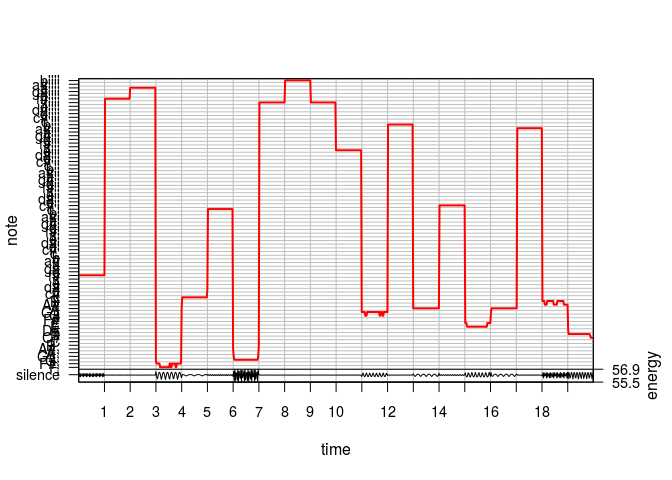
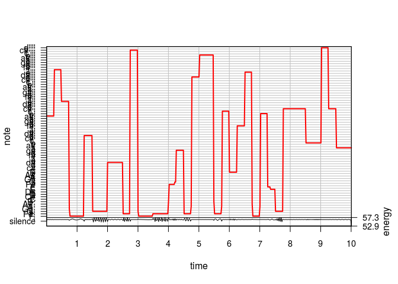

The purpose of this document is to provide examples for generating music using the functions I have created.

### Simple random notes:
The first example will show how to generate music using the simple random sample method:

First generate a sample:

```r
n <- 5 #assign the number of measures to output
sample1 <- generate_simple_sample(n)
```

Create the file, which will be placed in the specified path:

```r
generate_lilypond(sample1, n, file_name = here("results", "function_examples_ex1.ly"))
```

<!-- -->

And the function with plot the notes, which can be diabled with an argument. This example song can be found in the 'results' directory called 'function_examples_ex1.ly'.

### Simple random notes with rhythm:
The second example will show how to generate a song with more variation in speed.

Generate the sample, specifying the number of measures:

```r
m <- 5 #assign the number of measures to output
sample2 <- generate_rhythm_sample(m)
```

Create the file, which will be placed in the specified path:

```r
generate_lilypond(sample2, m, file_name = here("results", "function_examples_ex2.ly"))
```

<!-- -->

The notes are as shown above, and this example song can be found in the 'results' directory called 'function_examples_ex2.ly'.

### Rhythm and notes with consonance:

The third example will show the use of generating notes using Markov chains.

Generate the sample, specifying the number of measures and providing the transition matrix:

One example of a transition matrix is a distribution where notes with frequencies clustured around the middle of the possible range (around 300 Hz).

```r
P <- matrix(unlist(rerun(88,exp(c(1:44,44:1)))), 88, 88, byrow = TRUE)
P <- P/rowSums(P)
```

Sample the notes:

```r
n <- 5 #number of measures
sample3 <- generate_markov_sample(5, P)
```

Create the file, which will be placed in the specified path:

```r
generate_lilypond(sample3, n, file_name = here("results", "function_examples_ex3.ly"))
```

<!-- -->

Note that the initial note is generated randomly, but as more notes are sampled, the notes are clustered around the middle frequencies. Note that although the notes have similar frequencies, this song may not produce notes that have consonance. Also note that this example song can be found in the 'results' directory called 'function_examples_ex3.ly'.
