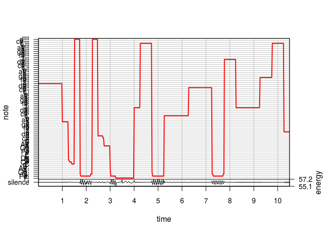

## Consonace 

 - Which notes sound good together?
 
 - Notes with frequencies with simple ratios
 
 - The different scales are examples of notes with consonant sounds

The purpose of this file is to implement more consonant notes in my simulation of music. 

The following data was found at the following source:

 - Suits, B. H., Physics of Music - Notes. Physics Department, Michigan Technological University. http://pages.mtu.edu/~suits/notefreqs.html

Read in notes data:

```r
full_notes <- read.csv(here("data", "note_freq.csv")) #includes all parts of dataframe
full_notes
```

```
##     X      Note Frequency..Hz. Wavelength..cm.
## 1   1        A0          27.50         1254.55
## 2   2  A#0/Bb0           29.14         1184.13
## 3   3        B0          30.87         1117.67
## 4   4        C1          32.70         1054.94
## 5   5  C#1/Db1           34.65          995.73
## 6   6        D1          36.71          939.85
## 7   7  D#1/Eb1           38.89          887.10
## 8   8        E1          41.20          837.31
## 9   9        F1          43.65          790.31
## 10 10  F#1/Gb1           46.25          745.96
## 11 11        G1          49.00          704.09
## 12 12  G#1/Ab1           51.91          664.57
## 13 13        A1          55.00          627.27
## 14 14  A#1/Bb1           58.27          592.07
## 15 15        B1          61.74          558.84
## 16 16        C2          65.41          527.47
## 17 17  C#2/Db2           69.30          497.87
## 18 18        D2          73.42          469.92
## 19 19  D#2/Eb2           77.78          443.55
## 20 20        E2          82.41          418.65
## 21 21        F2          87.31          395.16
## 22 22  F#2/Gb2           92.50          372.98
## 23 23        G2          98.00          352.04
## 24 24  G#2/Ab2          103.83          332.29
## 25 25        A2         110.00          313.64
## 26 26  A#2/Bb2          116.54          296.03
## 27 27        B2         123.47          279.42
## 28 28        C3         130.81          263.74
## 29 29  C#3/Db3          138.59          248.93
## 30 30        D3         146.83          234.96
## 31 31  D#3/Eb3          155.56          221.77
## 32 32        E3         164.81          209.33
## 33 33        F3         174.61          197.58
## 34 34  F#3/Gb3          185.00          186.49
## 35 35        G3         196.00          176.02
## 36 36  G#3/Ab3          207.65          166.14
## 37 37        A3         220.00          156.82
## 38 38  A#3/Bb3          233.08          148.02
## 39 39        B3         246.94          139.71
## 40 40        C4         261.63          131.87
## 41 41  C#4/Db4          277.18          124.47
## 42 42        D4         293.66          117.48
## 43 43  D#4/Eb4          311.13          110.89
## 44 44        E4         329.63          104.66
## 45 45        F4         349.23           98.79
## 46 46  F#4/Gb4          369.99           93.24
## 47 47        G4         392.00           88.01
## 48 48  G#4/Ab4          415.30           83.07
## 49 49        A4         440.00           78.41
## 50 50  A#4/Bb4          466.16           74.01
## 51 51        B4         493.88           69.85
## 52 52        C5         523.25           65.93
## 53 53  C#5/Db5          554.37           62.23
## 54 54        D5         587.33           58.74
## 55 55  D#5/Eb5          622.25           55.44
## 56 56        E5         659.25           52.33
## 57 57        F5         698.46           49.39
## 58 58  F#5/Gb5          739.99           46.62
## 59 59        G5         783.99           44.01
## 60 60  G#5/Ab5          830.61           41.54
## 61 61        A5         880.00           39.20
## 62 62  A#5/Bb5          932.33           37.00
## 63 63        B5         987.77           34.93
## 64 64        C6        1046.50           32.97
## 65 65  C#6/Db6         1108.73           31.12
## 66 66        D6        1174.66           29.37
## 67 67  D#6/Eb6         1244.51           27.72
## 68 68        E6        1318.51           26.17
## 69 69        F6        1396.91           24.70
## 70 70  F#6/Gb6         1479.98           23.31
## 71 71        G6        1567.98           22.00
## 72 72  G#6/Ab6         1661.22           20.77
## 73 73        A6        1760.00           19.60
## 74 74  A#6/Bb6         1864.66           18.50
## 75 75        B6        1975.53           17.46
## 76 76        C7        2093.00           16.48
## 77 77  C#7/Db7         2217.46           15.56
## 78 78        D7        2349.32           14.69
## 79 79  D#7/Eb7         2489.02           13.86
## 80 80        E7        2637.02           13.08
## 81 81        F7        2793.83           12.35
## 82 82  F#7/Gb7         2959.96           11.66
## 83 83        G7        3135.96           11.00
## 84 84  G#7/Ab7         3322.44           10.38
## 85 85        A7        3520.00            9.80
## 86 86  A#7/Bb7         3729.31            9.25
## 87 87        B7        3951.07            8.73
## 88 88        C8        4186.01            8.24
```

```r
notes <- (read.csv("data/note_freq.csv"))$Frequency..Hz. #just the frequencies
```

The following will assign the sequence of numbers that corresponds to all octaves of a specific note in the frequency data.

```r
note_A <- seq(from = 1, to = 85, by = 12)
note_B <- seq(from = 3, to = 87, by = 12)
note_C <- seq(from = 4, to = 88, by = 12)
note_D <- seq(from = 6, to = 78, by = 12)
note_E <- seq(from = 8, to = 80, by = 12)
note_F <- seq(from = 9, to = 81, by = 12)
note_G <- seq(from = 11, to = 83, by = 12)

note_Asharp <- seq(from = 2, to = 86, by = 12)
note_Csharp <- seq(from = 5, to = 77, by = 12)
note_Dsharp <- seq(from = 4, to = 88, by = 12)
note_Fsharp <- seq(from = 4, to = 88, by = 12)
note_Gsharp <- seq(from = 4, to = 88, by = 12)
```

Create a transition matrix for the C major scale (C,D,E,F,G,A):

View the C Major note frequencies:

```r
C_major <- c(note_C,note_D, note_E, note_F, note_G, note_A)
C_major_full <- full_notes[C_major, ] 
C_major_full
```

```
##     X Note Frequency..Hz. Wavelength..cm.
## 4   4   C1          32.70         1054.94
## 16 16   C2          65.41          527.47
## 28 28   C3         130.81          263.74
## 40 40   C4         261.63          131.87
## 52 52   C5         523.25           65.93
## 64 64   C6        1046.50           32.97
## 76 76   C7        2093.00           16.48
## 88 88   C8        4186.01            8.24
## 6   6   D1          36.71          939.85
## 18 18   D2          73.42          469.92
## 30 30   D3         146.83          234.96
## 42 42   D4         293.66          117.48
## 54 54   D5         587.33           58.74
## 66 66   D6        1174.66           29.37
## 78 78   D7        2349.32           14.69
## 8   8   E1          41.20          837.31
## 20 20   E2          82.41          418.65
## 32 32   E3         164.81          209.33
## 44 44   E4         329.63          104.66
## 56 56   E5         659.25           52.33
## 68 68   E6        1318.51           26.17
## 80 80   E7        2637.02           13.08
## 9   9   F1          43.65          790.31
## 21 21   F2          87.31          395.16
## 33 33   F3         174.61          197.58
## 45 45   F4         349.23           98.79
## 57 57   F5         698.46           49.39
## 69 69   F6        1396.91           24.70
## 81 81   F7        2793.83           12.35
## 11 11   G1          49.00          704.09
## 23 23   G2          98.00          352.04
## 35 35   G3         196.00          176.02
## 47 47   G4         392.00           88.01
## 59 59   G5         783.99           44.01
## 71 71   G6        1567.98           22.00
## 83 83   G7        3135.96           11.00
## 1   1   A0          27.50         1254.55
## 13 13   A1          55.00          627.27
## 25 25   A2         110.00          313.64
## 37 37   A3         220.00          156.82
## 49 49   A4         440.00           78.41
## 61 61   A5         880.00           39.20
## 73 73   A6        1760.00           19.60
## 85 85   A7        3520.00            9.80
```

Note that middle C is the fourth element in 'C_major', and each note has 7 octaves, except for C and A which have 8. 

Create a transition matrix that only considers notes in the C major scale:

```r
P1 <- matrix(numeric(88), nrow = 88, ncol = 88) #create a zero matrix
P1[C_major, C_major] = 1/length(C_major)
rowSums(P1)
```

```
##  [1] 1 0 0 1 0 1 0 1 1 0 1 0 1 0 0 1 0 1 0 1 1 0 1 0 1 0 0 1 0 1 0 1 1 0 1
## [36] 0 1 0 0 1 0 1 0 1 1 0 1 0 1 0 0 1 0 1 0 1 1 0 1 0 1 0 0 1 0 1 0 1 1 0
## [71] 1 0 1 0 0 1 0 1 0 1 1 0 1 0 1 0 0 1
```

Note that the row sums for the matrix are all 1 for the notes that we are considering, which is what is expected for a Markov transition matrix. 


```r
sample1 <- markov_music(5,P1)
generate_lilypond(sample1, 5, file_name = here("results", "implement_consonance_ex1.ly"))
```

<!-- -->

This song sounds much more pleasant to listen to than notes randomly sampled from all 88.

Note that this process is equivalent to sampling randomly from C major notes, since only C major notes have nonzero probability, with equal probability. This example song can be found in the 'results' directory called 'implement_consonance_ex1.ly'.

Next, the C_major scale will be sampled from, but the probability of getting a note in a similar octave is greater than of a lower or higher octave.

Gather the notes from each octave skipping 0 and 8:

```r
sorted_C_major <- sort(C_major) #sort the notes
octaves <- list() #create an empty list
count <- 2 #the first note is at position 2
for( i in 1:7){
   octaves[i] <- list(sorted_C_major[count:(count+5)]) #each octave is 6 notes before a note is repeated
   count <- count + 6
} 
```

Create the transition matrix where notes in the same octave have a higher probability of being selected.

```r
p1 <- 1 #weight for sampling from a different octave
p2 <- 2 #weight for sampling from the same octave
P2 <- matrix(numeric(88), nrow = 88, ncol = 88)
for (i in 1:7){
   for(j in 1:7){
      if(j != i){
         P2[unlist(octaves[i]), unlist(octaves[j])] <- p1/(p1*36 + p2*6) #ensures the rows sum to one
      }else{
         P2[unlist(octaves[i]), unlist(octaves[i])] <- p2/(p1*36 + p2*6)
      }
   }
}
```


```r
sample2 <- markov_music(5, P2)
generate_lilypond(sample2, 5, file_name = here("results", "implement_consonance_ex2.ly"))
```

<!-- -->

This still gives a lot of variation in pitch of each note, so I will not implement a method that constrains each note closer to its own octave. This example song can be found in the 'results' directory called 'implement_consonance_ex2.ly'.

Create a transition matrix where notes sampled are more likely to be in the same octave or an octave one above

```r
p1 <- .01 #weight for sampling from two or more octaves below 
p2 <- 1 #weight for sampling from within 1 octaves
p3 <- 5 #weight for sampling from the same octave
P3 <- matrix(numeric(88), nrow = 88, ncol = 88)
for (i in 1:7){
   for(j in 1:7){
      if(j != i){
         if(abs(j-i) > 1){
            P3[unlist(octaves[i]), unlist(octaves[j])] <- p1  #weight for greater than one octave away
         }else{
            P3[unlist(octaves[i]), unlist(octaves[j])] <- p2 #weight for one octave away
         }
      }else{
         P3[unlist(octaves[i]), unlist(octaves[i])] <- p3 #weight for the same octave
      }
   }
}

#the following ensures that the row sums are equal to 1
sums <- rowSums(P3)
P3[sums != 0, ] <- P3[sums != 0, ]/(sums[sums != 0])
rowSums(P3)
```

```
##  [1] 0 0 0 1 0 1 0 1 1 0 1 0 1 0 0 1 0 1 0 1 1 0 1 0 1 0 0 1 0 1 0 1 1 0 1
## [36] 0 1 0 0 1 0 1 0 1 1 0 1 0 1 0 0 1 0 1 0 1 1 0 1 0 1 0 0 1 0 1 0 1 1 0
## [71] 1 0 1 0 0 1 0 1 0 1 1 0 1 0 1 0 0 0
```

Generate the file:

```r
sample3 <- markov_music(5, P3)
generate_lilypond(sample3, 5, file_name = here("results", "implement_consonance_ex3.ly"))
```

<!-- -->

The notes appear to be closer together, which indiciates that there is less variation in which octaves the notes are contained in, so this implementation seems to be working. This example song can be found in the 'results' directory called 'implement_consonance_ex3.ly'.
