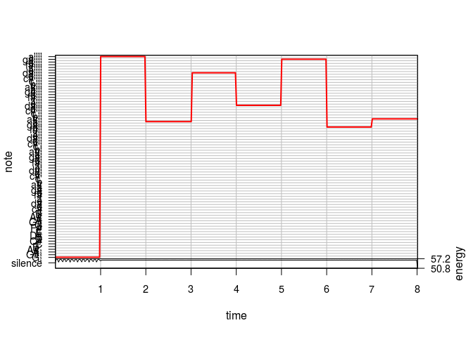

This file includes my process for implementing Markov Chains. Note that this code is influenced by an example in a textbook:

Braun W., Murdoch D. (2016). A First Course in Statistical Programming with R. Cambridge: Cambridge University Press, 143-147.

Which can be found under 'Resources' in the 'doc' directory.

Create a transition Matrix for an event with three possible states:

```r
P <- matrix(c(0.5, 0.4, 0.1, 0.5, 0.4, 0.1, 0, 0.25, 0.75), 3, 3, byrow = TRUE)
P
```

```
##      [,1] [,2] [,3]
## [1,]  0.5 0.40 0.10
## [2,]  0.5 0.40 0.10
## [3,]  0.0 0.25 0.75
```

Create one possible set of steps:

```r
steps <- numeric(100) #create a vector of 0's
steps[1] <- 1 #assign the first step
for (t in 1:99){
  #use the probabilities in the transition matrix to generate subsequent steps
  steps[t + 1] <- sample(1:3, size = 1, prob = P[steps[t], ])
}
table(steps)
```

```
## steps
##  1  2  3 
## 34 38 28
```

Read in the notes frequencies for testing:

```r
notes <- (read.csv("data/note_freq.csv"))$Frequency..Hz.
three_notes <- notes[48:50] #load in three notes
```


```r
#use an arbitrary transition matrix
n <- 5 #assign the number of notes to generate
P <- matrix(c(0.5, 0.4, 0.1, 0.5, 0.4, 0.1, 0, 0.25, 0.75), 3, 3, byrow = TRUE)
#follow the same process as above
samp <- numeric(n)
samp <- 3 # the first step is frequency 3
for (t in 1:(n-1)){
  samp[t + 1] <- sample(1:3, size = 1, prob = P[samp[t], ])
}
samp <- three_notes[samp]
samp #print the sample generated
```

```
## [1] 466.16 440.00 415.30 440.00 440.00
```

Note that this sample could now be used to generate a .ly file to listen to the notes.

Create an arbitrary transition matrix, which gives higher probability to higher notes:

```r
n <- 88
P <- matrix(unlist(rerun(n,c(rep(0,n/2),(n/2 + 1):n))), n, n, byrow = TRUE)
P <- P/rowSums(P)
```

Use this matrix to sample from all of the possible 88 notes:

```r
m <- 8 #assign the number of notes to generate
samp1 <- numeric(m)
samp1[1] <- 1 #assign the first step to 1
for (t in 1:(m-1)){
  samp1[t + 1] <- sample(1:88, size = 1, prob = P[samp1[t], ])
}

generate_lilypond(map(notes[samp1], ~ (sine(.))), bars = 2, file_name = here("results", "implement_markov_ex1")) #generate a .ly file for the sampled notes
```

<!-- -->

It appears that the higher notes are selected more often, providing evidence that our Markov chain implementation is indeed working. This example song can be found in the 'results' directory called 'implement_markov_ex1'.

