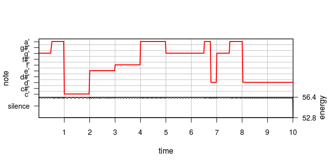

## 1  Introduction
  To begin the process of simulating music, a basic definition of music was determined and used as the motivation for the simulation. A large portion of what defines music is the relationship between each sound of a song. The relationship between each sound in music can be described by the ratio between the frequencies of subsequent sounds. Only certain ratios between frequencies are "allowed"; typically the frequencies that satisfy the requirement for music are in accordance with one of the existing scales, or groupings of ordered fundamental frequencies, which divide the octave (an interval where the ending frequency is double the beginning frequency) [1]. The heptatonic scale, which contains seven notes per octave, is the scale that this project will base its simulation on. Therefore, songs composed of notes from an established scale will create the fundamental quality that defines music.

The concept of simple ratios between frequencies and musical scales gives rise to the concept of consonance and dissonance between notes, where consonant sounds are sound that are pleasant to hear, they sound "good" together, while dissonant sounds are harsher together, they seem like they clash. Notes with simple ratios between their frequencies  are more consonant, where the ratio 3:2 (a perfect fifth) and 1:2 (an octave) are significantly consonant and underlie the consonance within a scale [2].

As well as which frequencies a song must have to be considered musical, there are more complex aspects of what makes sound music. There are many different dimensions of music, such as melodic form, tones and pitch (related to frequency), rhythm and rhythmic shifts, and intonation [6]. For the purposes of this project, to simplify the process of generating music, the focus will be placed on generating notes that are related based on the heptatonic scale as well as implementing aspects of rhythm, which includes the duration of notes as well as pattern in notes.

## 2 Methods
The general process used for generating a song includes implementing functions that generate a sample of notes, then implementing another function that outputs a playable file. Note that the songs are generated using a time signature of common time (4 beats per measure, where a beat is considered a quarter note). 

### 2.1 Sampling
For this project, the notes that were sampled from are the 88 notes that can be found on a standard piano, with each note frequency corresponding to the data found at [7]. Three methods were implemented to generate a sample of notes. One method was based on a simple random sample of all 88 notes, where each note is a quarter note, another method implements a rhythm in the form of variations in the duration of each note, and the third implements a Markov Chain model based off of common scales, where notes that are in consonance with each other are more likely to be sampled together.

The first approach used for sampling notes includes taking a sample of a specified size from all 88 notes, where each is equally likely to be selected and each note is of the same length. This is a naive approach, since music as defined above depends on consonance between notes, which is not guaranteed by a random sample. This approach also diregards the rhymthic aspect of music, as each note is the same length.

The second approach used for sampling notes includes, again, taking a simple random sample of all 88 notes; however, instead of each note having the same length, the length of each note is also randomly chosen. Randomly sampling the duration for each note individually provides complications, since the total length of the song and number of measures will vary with each sample. Therefore, the length of each note was sampled by measure in the form of number of notes, where each measure has the same duration. The set of all possible measures, with four possible note types (whole, half, quarter, eighth) was generated by number of notes, where 1 is the smallest, and 8 is the largest possible number of notes. Where each number of notes has an equal chance of being selected. Note that this approach produces variation in the speed of notes, which translates to rhythm in some sense, but the pattern and repetition that accompany rhythm are ignored in this method.

The third approach used for sampling notes incorporates the concept of consonace, using Markov chains. [3]

### 2.2 Output
In order to sample notes in a useable format to produce a playable file, R package "tuneR" is useful for generating Wave objects, which hold sound information. Once frequencies are sampled, each note can be converted into a Wave format, which can then be converted into a periodogram, which estimates the spectral density of a wave object, and finally into a Wspec object which holds the information for multiple periodograms. The information held in the Wspec object can then be used to generate a file readable by the Lilypond program, where the file output of choice for this project is the Lilypond file format. Lilypond is a compiled text program that converts text to an audio file as well as into to sheet music. Thus a sample of frequencies can be converted into a format readable by Lilypond and therefore into a playable format.

### 2.x Correctness

### 2.x Reproducability

### 2.x Efficiency

### 2.x Documentation

## 3 Conclusions

### 3.1 Results
 - a way to sample from notes and generate a playable file
 - a way to implement rhythm
 - a way to implement relationships between notes
 
<!-- -->
 

### 3.2 Further Study
  The results as described above came close to producing a pleasant tune, but due to the multidimensionality and complexity of music, there are still many aspects of music that have not been implemented in this project. One possibility includes adding more complexity to the Markov chain method for sampling notes, so that more recognizable patterns occur. There are more musical scales to explore, left and right hand notes, chords instead of single notes, and tempo as well as many more aspects not mentioned. There is more work to be done before music as we can recognize it is generated using these methods.

## 4 References

[1] Araya-Salas, M. (2012). Is birdsong music?. Significance, 9: 4-7. doi:10.1111/j.1740-9713.2012.00613.x

[2] Benson, D. (2008). Music: a Mathematical Offering. Cambridge: Cambridge University Press.

[3] Braun W., Murdoch D. (2016). A First Course in Statistical Programming with R. Cambridge: Cambridge University Press, 143-147.

[4] Kogan J., Margoliash D. (1998). Automated recognition of bird song elements from continuous recordings using dynamic time warping and hidden Markov models: A comparative study. The Journal of the Acoustical Society of America, 103 (4), 2185-2196. 10.1121/1.421364

[5] Ligges, U., Package 'tuneR'. 2018. https://cran.r-project.org/web/packages/tuneR/tuneR.pdf

[6] Mocnik, F.B (2018). Tradition as a Spatiotemporal Process - The Case of Swedish Folk Music. Proceedings of the 21st AGILE Conference on Geographic Information Science.

[7] Suits, B. H., Physics of Music - Notes. Physics Department, Michigan Technological University. http://pages.mtu.edu/~suits/notefreqs.html
