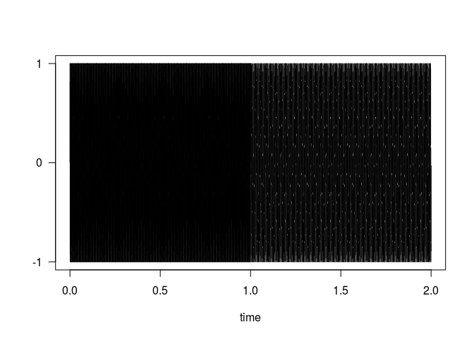
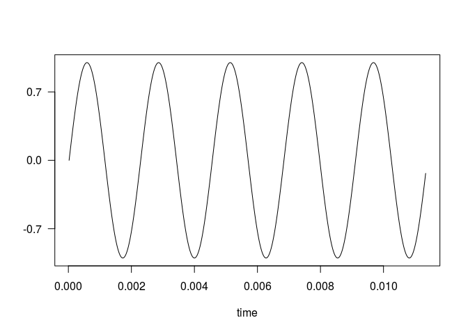
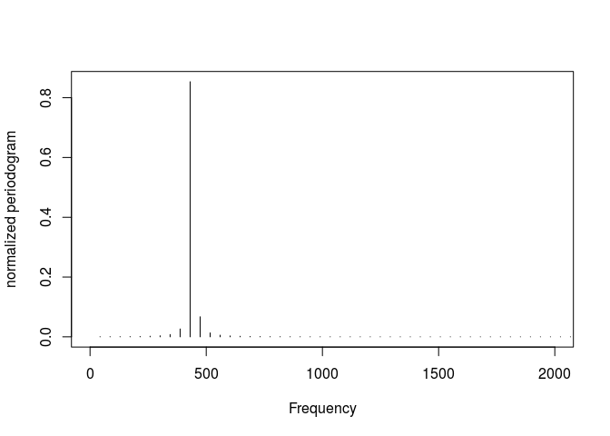
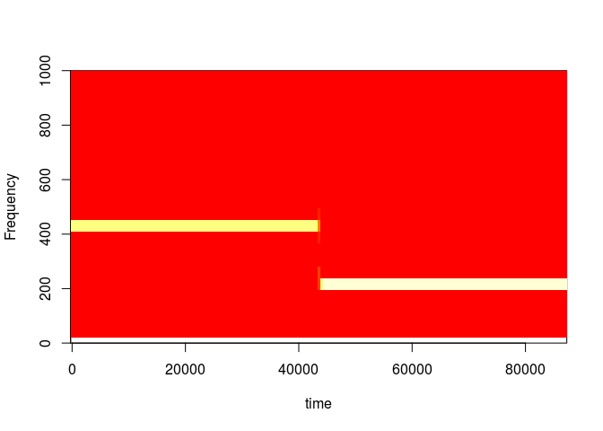
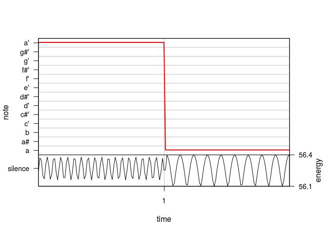

This file reproduces code from a helpful resource, which gives various ways to analyze and manipulate a wave object. The code can be found at:
https://www.rdocumentation.org/packages/tuneR/versions/1.3.3/topics/tuneR 
 
The sine() function produces a Wave object at a given frequency for 1 second, unless specified otherwise.


```r
Wobj <- bind(sine(440), sine(220)) # bind concatenates wave objects
show(Wobj) # shows the structure of a wave object
```

```
## 
## Wave Object
## 	Number of Samples:      88200
## 	Duration (seconds):     2
## 	Samplingrate (Hertz):   44100
## 	Channels (Mono/Stereo): Mono
## 	PCM (integer format):   FALSE
## 	Bit (8/16/24/32/64):    32
```


```r
plot(Wobj) # plots the wave object
```

<!-- -->

Plots a section of the wave object:

```r
plot(extractWave(Wobj, from = 1, to = 500))
```

<!-- -->

Creates a Wspec object using the wave object from above, and plots the frequency:

```r
WspecObject <- periodogram(Wobj, normalize = TRUE, width = 1024, overlap = 512)
plot(WspecObject, xlim = c(0, 2000))
```

<!-- -->

A plot of frequency vs. time:

```r
image(WspecObject, ylim = c(0, 1000))
```

<!-- -->
Gets the notes of the wspec object:

```r
ff <- FF(WspecObject)
notes <- smoother(noteFromFF(ff))
```

Creates a plot of the melody and energy:

```r
melodyplot(WspecObject, notes)
```

<!-- -->

Creates a datafram that can be used to produce a Lilypad file:

```r
qlily <- quantMerge(notes, 4, 4, 2)
qlily
```

```
##   note duration punctuation  slur
## 1    0        1       FALSE FALSE
## 5  -12        1       FALSE FALSE
```

Write a Lilypad file using the dataframe created above:

```r
lilyinput(qlily, file = here("results", "wave_to_lily_ex.ly"))
```

When played, the output should be two notes, one of which is an octave above the other. The plots generated above should reflect this. This example song can be found in the 'results' directory called 'wave_to_lily_ex.ly'.

