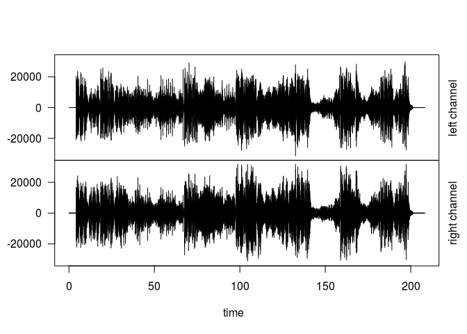

## Related Resources
 
This file provides resources related to my project, as well as my notes.
 
#### 1. Araya-Salas, M. (2012). Is birdsong music?. Significance, 9: 4-7. doi:10.1111/j.1740-9713.2012.00613.x

- claims music follows "strict rules", frequencies in simple ratios to be considered musical intervals. One example: in the ratio of 5:4.
- musical intervals based on "subdivision of the octave"
- determine presence of interval, measure ratio of consecutive notes
- three different human musical scales: diatonic, pentatonic, and chromatic
- the R code used by the author can be found at https://rpubs.com/marcelo-araya-salas.

#### 2. Mocnik, F.B (2018). Tradition as a Spatiotemporal Process - The Case of Swedish Folk Music. Proceedings of the 21st AGILE Conference on Geographic Information Science.

- This article discusses the role of tradition in the music that is passed down. 
- claims music is not one-dimensional: melodic form, tones and pitch, rhythmic shifts, tones and intonations
- mainly focuses on what drives tradition, rather than than the music itself, which may not be as helpful for my project

#### 3. Braun W., Murdoch D. (2016). A First Course in Statistical Programming with R. Cambridge: Cambridge University Press, 143-147.
- Discusses Markov chain simulation and how it can be used to simulate music.
- Markov chains useful to model systems with short memories
- Can use Markov chain Monte Carlo to approximate the invariant distribution
- "Lilypond" format used to represent musical scores (tools at http://lilybin.com/)
- provide R code to randomly sample notes to compose music

#### 4. Kogan J., Margoliash D. (1998). Automated recognition of bird song elements from continuous recordings using dynamic time warping and hidden Markov models: A comparative study. The Journal of the Acoustical Society of America, 103 (4), 2185-2196. 10.1121/1.421364

- discusses the setbacks of manual inspection of animal vocalization
- proposes method of a reliable automated recognition method using methods developed in speech recognition
- discusses Long Continuous Song Recognition and hidden Markov models
- applying these methods to bird song
- this source may not be as useful for my purposes, simulating music
#### 5. Benson, D. (2008). Music: a Mathematical Offering. Cambridge: Cambridge University Press.
- a book about the mathematics behind music, including waves and harmonics, different scales, and how music is stored digitally.
- the chapters related to digital music and synthesis may be most helpful for my purposes. The information related to scales and ratios may also be useful.
-  "Stringed and wind instruments naturally produce a sound
that consists of exact integer multiples of a fundamental frequency."

## R package exploration

Sources for related R packages:

- https://cran.r-project.org/web/packages/tuneR/index.html (tuneR)
- https://cran.r-project.org/web/packages/seewave/vignettes/seewave_IO.pdf (seewave, tuneR, and audio)
- https://cran.r-project.org/web/packages/warbleR/index.html (warbleR)


TuneR:

The following MP3 file was generated from a youtube video: https://www.youtube.com/watch?v=Xix3UOOtND4.

Reading an MP3 returns a wave object:

```r
vivaldi <- readMP3("data/vivaldi.mp3")
plot(vivaldi) # plots the wave file
```

<!-- -->

The wave file can then be played:

```r
#play(vivaldi,wmplayer.exe) #note this does not work on the cloud
```

Audio:

```r
#audio::play(vivaldi) #this does not work on the cloud either
```

Note that I investigated seewave, but I decided it was not useful for my project.
